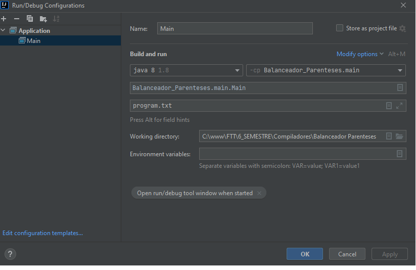

## Projeto Design Patterns - Galpão Logistico 
<h5>Software simples que simula o cadastro recebimento e saida de itens<h5> 

<!--te-->

#### 🛠 Caracteristicas do sistema 🛠
* Design Pattern Observer

 ### ⚠️ Sobre o desenvolvimento ⚠️

- Plataforma utilizada : Intellj
- Versão Java: 11.0.2

### Configurar ambiente ⛏⛏

A figura abaixo exibe como deve ser configurado o IntelliJ

💻 ## Desenvolvedores

<table>
    <tr>
        <td>Yago Caetano</td>
        <td>RA: 081190027</td>
				<td>https://github.com/Yago-Caetano</td>
    </tr>
    <tr>
        <td>Rodrigo Emiliano</td>
        <td>RA: 081190004</td>
				<td>https://github.com/RodrigoEmiliano27</td>
    </tr>
</table>
